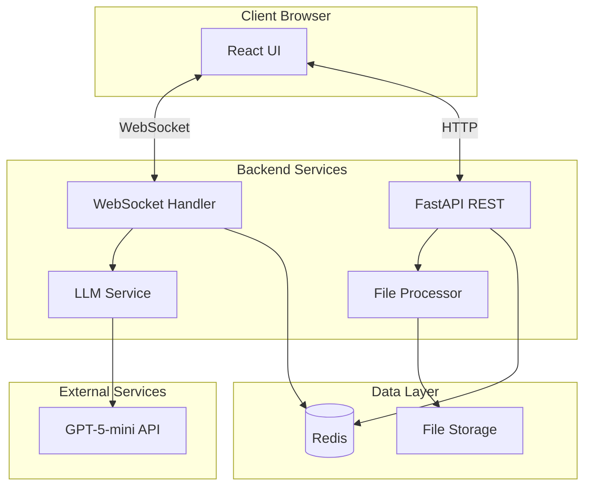

# AI-Powered HTML Builder - Technical Design Document

## 1. Executive Summary

### 1.1 Project Overview
An AI-powered web application that enables users to generate styled HTML/CSS documents through natural language chat interactions and file uploads. The system uses OpenAI's GPT-5-mini model to transform user inputs into professionally formatted, single-file HTML outputs with real-time preview and editing capabilities.

### 1.2 Key Features
- **Interactive Chat Interface**: Natural language processing for HTML generation
- **File Upload Support**: Process .txt, .docx, and .md files (50MB limit)
- **Real-time Rendering**: Live preview of generated HTML with toggle between rendered and code views
- **Adjustable UI**: Draggable split-pane interface for optimal workspace management
- **Single-file Export**: All CSS/JS inlined for portable HTML documents
- **Session Isolation**: Privacy-focused design with no cross-user data visibility

### 1.3 Technical Stack
- **Frontend**: React 18 with WebSocket support
- **Backend**: FastAPI with async capabilities
- **LLM**: OpenAI GPT-5-mini API
- **Session Store**: Redis for distributed session management
- **Containerization**: Podman/Docker
- **Target Deployment**: POP server (12 cores, 16GB RAM, 1.7TB storage)

---

## 2. System Requirements & Constraints

### 2.1 Functional Requirements
| Requirement | Specification |
|------------|---------------|
| Concurrent Users | Maximum 8 simultaneous sessions |
| Session Duration | 1 hour timeout on inactivity |
| Chat Iterations | Maximum 15 per session |
| File Types | .txt, .docx, .md (PDF excluded for v1) |
| File Size Limit | 50MB per upload |
| Export Format | Single HTML file with inline CSS/JS |
| Response Time | < 10 seconds for HTML generation |

### 2.2 Non-Functional Requirements
- **Performance**: Handle 8 concurrent WebSocket connections smoothly
- **Scalability**: Designed for horizontal scaling (future enhancement)
- **Security**: API key protection, input sanitization, rate limiting
- **Reliability**: 99% uptime during business hours
- **Usability**: Intuitive interface requiring no technical knowledge
- **Privacy**: Complete session isolation, no persistent user data

### 2.3 Design Constraints
- Must deploy as Podman container
- Single-file HTML output requirement
- No user authentication in v1
- Central API key management (no per-user keys)
- Brand colors: Navy blue, light blue, white, grey
- Font stack: Benton Sans (primary), Arial (fallback)

---

## 3. Architecture Overview

### 3.1 High-Level Architecture



### 3.2 Component Architecture

```
┌─────────────────────────────────────────────────────────────┐
│                         Frontend (React)                     │
├───────────────────┬──────────────────┬─────────────────────┤
│   Chat Window     │   HTML Viewer     │   Layout Manager    │
│  - Message List   │  - HTML Renderer  │  - Split Pane       │
│  - Input Box      │  - Code Editor    │  - Header           │
│  - File Upload    │  - View Toggle    │  - Export Button    │
└───────────────────┴──────────────────┴─────────────────────┘
                              │
                    WebSocket │ HTTP
                              │
┌─────────────────────────────────────────────────────────────┐
│                       Backend (FastAPI)                      │
├───────────────────┬──────────────────┬─────────────────────┤
│  WebSocket Layer  │   API Endpoints   │   Service Layer     │
│  - Connection Mgr │  - /chat          │  - LLM Service      │
│  - Message Router │  - /upload        │  - HTML Generator   │
│  - Session Handler│  - /export        │  - File Processor   │
└───────────────────┴──────────────────┴─────────────────────┘
                              │
                         Redis │ GPT-5
                              │
┌─────────────────────────────────────────────────────────────┐
│                         Data Layer                           │
├───────────────────────────┬─────────────────────────────────┤
│      Redis                │       File System               │
│  - Session State          │  - Temp File Storage           │
│  - Message History        │  - Generated HTML Cache        │
│  - Rate Limiting          │                                 │
└───────────────────────────┴─────────────────────────────────┘
```

### 3.3 Project Structure

```
ai-html-builder/
├── frontend/                    # React application
│   ├── src/
│   │   ├── components/
│   │   │   ├── ChatWindow/
│   │   │   │   ├── ChatInput.tsx
│   │   │   │   ├── MessageList.tsx
│   │   │   │   ├── FileUpload.tsx
│   │   │   │   └── index.tsx
│   │   │   ├── HtmlViewer/
│   │   │   │   ├── HtmlRenderer.tsx
│   │   │   │   ├── CodeEditor.tsx
│   │   │   │   ├── ViewToggle.tsx
│   │   │   │   └── index.tsx
│   │   │   ├── Layout/
│   │   │   │   ├── SplitPane.tsx
│   │   │   │   ├── Header.tsx
│   │   │   │   └── index.tsx
│   │   │   └── common/
│   │   │       ├── Toast.tsx
│   │   │       ├── ProgressBar.tsx
│   │   │       └── Button.tsx
│   │   ├── hooks/
│   │   │   ├── useWebSocket.ts
│   │   │   ├── useSession.ts
│   │   │   └── useToast.ts
│   │   ├── services/
│   │   │   ├── api.ts
│   │   │   └── websocket.ts
│   │   ├── utils/
│   │   │   ├── htmlExporter.ts
│   │   │   └── fileValidator.ts
│   │   ├── types/
│   │   │   └── index.ts
│   │   ├── styles/
│   │   │   ├── globals.css
│   │   │   └── variables.css
│   │   ├── App.tsx
│   │   └── main.tsx
│   ├── public/
│   ├── package.json
│   ├── tsconfig.json
│   └── vite.config.ts
│
├── backend/                     # FastAPI application
│   ├── app/
│   │   ├── api/
│   │   │   ├── endpoints/
│   │   │   │   ├── chat.py
│   │   │   │   ├── upload.py
│   │   │   │   ├── export.py
│   │   │   │   └── health.py
│   │   │   ├── websocket.py
│   │   │   └── middleware.py
│   │   ├── core/
│   │   │   ├── config.py
│   │   │   ├── prompts.py
│   │   │   ├── session.py
│   │   │   └── rate_limiter.py
│   │   ├── services/
│   │   │   ├── llm_service.py
│   │   │   ├── html_generator.py
│   │   │   ├── file_processor.py
│   │   │   └── redis_service.py
│   │   ├── models/
│   │   │   ├── schemas.py
│   │   │   └── session.py
│   │   ├── utils/
│   │   │   ├── sanitizer.py
│   │   │   └── logger.py
│   │   └── main.py
│   ├── requirements.txt
│   ├── .env.example
│   └── pyproject.toml
│
├── tests/                       # Test suite
│   ├── frontend/
│   │   ├── unit/
│   │   │   ├── components/
│   │   │   └── services/
│   │   └── integration/
│   │       └── e2e/
│   └── backend/
│       ├── unit/
│       │   ├── test_llm_service.py
│       │   ├── test_file_processor.py
│       │   └── test_session.py
│       └── integration/
│           ├── test_websocket.py
│           └── test_api.py
│
├── deployment/
│   ├── Containerfile           # Podman configuration
│   ├── docker-compose.yml
│   └── nginx.conf
│
├── scripts/
│   ├── setup.sh
│   └── cleanup.sh
│
├── docs/
│   ├── API.md
│   ├── DEPLOYMENT.md
│   └── TESTING.md
│
├── .github/
│   └── workflows/
│       └── ci.yml
│
├── README.md
├── LICENSE
└── .gitignore
```

---

## 4. Detailed Component Design

### 4.1 Frontend Components

#### 4.1.1 ChatWindow Component
```typescript
interface ChatWindowProps {
  sessionId: string;
  onSendMessage: (message: string, files?: File[]) => void;
  messages: Message[];
  isProcessing: boolean;
}

// Features:
// - Message history display with sender identification
// - Text input with multiline support
// - File upload with drag-and-drop
// - Processing indicator
// - Auto-scroll to latest message
```

#### 4.1.2 HtmlViewer Component
```typescript
interface HtmlViewerProps {
  htmlContent: string;
  viewMode: 'rendered' | 'code';
  onContentEdit: (newContent: string) => void;
  isFullscreen: boolean;
}

// Features:
// - Iframe sandbox for rendered view
// - Monaco editor for code view
// - Syntax highlighting
// - Real-time updates
// - Fullscreen mode
```

#### 4.1.3 SplitPane Component
```typescript
interface SplitPaneProps {
  topContent: ReactNode;
  bottomContent: ReactNode;
  defaultPosition?: number;
  minSize?: number;
  maxSize?: number;
}

// Features:
// - Draggable divider
// - Position persistence in session
// - Responsive constraints
// - Smooth animations
```

### 4.2 Backend Services

#### 4.2.1 LLM Service
```python
class LLMService:
    def __init__(self, api_key: str):
        self.client = OpenAI(api_key=api_key)
        self.model = "gpt-5-mini"
    
    async def generate_html(
        self,
        user_input: str,
        context: List[Message],
        system_prompt: str
    ) -> str:
        """
        Generate HTML based on user input and conversation context
        
        Features:
        - Context-aware generation
        - Token optimization
        - Error handling with fallback
        - Response streaming support
        """
```

#### 4.2.2 Session Manager
```python
class SessionManager:
    def __init__(self, redis_client: Redis):
        self.redis = redis_client
        self.ttl = 3600  # 1 hour
    
    async def create_session(self) -> str:
        """Create new isolated session"""
    
    async def get_session(self, session_id: str) -> Session:
        """Retrieve session with validation"""
    
    async def update_session(self, session_id: str, data: dict):
        """Update session with TTL refresh"""
    
    async def cleanup_expired(self):
        """Background task for session cleanup"""
```

#### 4.2.3 File Processor
```python
class FileProcessor:
    MAX_SIZE = 50 * 1024 * 1024  # 50MB
    ALLOWED_TYPES = ['.txt', '.md', '.docx']
    
    async def process_file(self, file: UploadFile) -> str:
        """
        Extract text content from uploaded files
        
        Features:
        - File type validation
        - Size limit enforcement
        - Format preservation for .docx
        - Encoding detection
        - Malware scanning (optional)
        """
```

### 4.3 WebSocket Protocol

#### 4.3.1 Message Format
```typescript
interface WebSocketMessage {
  type: 'chat' | 'update' | 'error' | 'status';
  sessionId: string;
  payload: {
    content?: string;
    htmlOutput?: string;
    error?: string;
    progress?: number;
  };
  timestamp: number;
}
```

#### 4.3.2 Connection Lifecycle
```python
@app.websocket("/ws/{session_id}")
async def websocket_endpoint(websocket: WebSocket, session_id: str):
    # 1. Validate session
    # 2. Accept connection
    # 3. Register in connection manager
    # 4. Handle messages with error recovery
    # 5. Clean up on disconnect
```

---

## 5. API Specifications

### 5.1 REST Endpoints

#### POST /api/upload
```yaml
Description: Upload file for processing
Request:
  Content-Type: multipart/form-data
  Body:
    file: binary
    sessionId: string
Response:
  200:
    extractedText: string
    fileInfo:
      name: string
      size: number
      type: string
  400:
    error: string
  413:
    error: "File too large"
```

#### POST /api/export
```yaml
Description: Export generated HTML
Request:
  Body:
    sessionId: string
    htmlContent: string
Response:
  200:
    Content-Type: text/html
    Content-Disposition: attachment; filename="generated.html"
  404:
    error: "Session not found"
```

#### GET /api/health
```yaml
Description: Health check endpoint
Response:
  200:
    status: "healthy"
    timestamp: number
    redis: "connected" | "disconnected"
    version: string
```

### 5.2 WebSocket Events

#### Client → Server
```typescript
// Send chat message
{
  type: "chat",
  content: string,
  attachments?: string[]  // Extracted text from files
}

// Request current state
{
  type: "sync"
}
```

#### Server → Client
```typescript
// HTML update
{
  type: "update",
  htmlOutput: string,
  iteration: number
}

// Processing status
{
  type: "status",
  progress: number,  // 0-100
  message: string
}

// Error notification
{
  type: "error",
  error: string,
  recoverable: boolean
}
```

---

## 6. Data Models & Storage

### 6.1 Redis Schema

#### Session Object
```json
{
  "session:<session_id>": {
    "created_at": 1234567890,
    "last_activity": 1234567890,
    "iteration_count": 5,
    "messages": [...],
    "current_html": "<html>...",
    "split_position": 50,
    "rate_limit": {
      "requests": 10,
      "window_start": 1234567890
    }
  }
}
```

#### Connection Registry
```json
{
  "connections": {
    "<session_id>": {
      "connected_at": 1234567890,
      "client_ip": "192.168.1.1",
      "last_ping": 1234567890
    }
  }
}
```

### 6.2 Temporary File Storage
```
/tmp/ai-html-builder/
├── uploads/
│   └── <session_id>/
│       └── <timestamp>_<filename>
└── generated/
    └── <session_id>/
        └── output.html
```

---

## 7. System Prompts & LLM Configuration

### 7.1 Primary System Prompt
```markdown
You are an expert HTML/CSS developer creating single-file HTML documents.

REQUIREMENTS:
1. Generate complete, valid HTML5 documents
2. All CSS must be inline in <style> tags
3. All JavaScript must be inline in <script> tags
4. No external dependencies or CDN links
5. Mobile-responsive by default using viewport meta tag
6. Use semantic HTML elements

DEFAULT STYLING (unless user specifies otherwise):
- Colors: Navy blue (#003366), Light blue (#4A90E2), White (#FFFFFF), Grey (#E5E5E5)
- Font stack: 'Benton Sans', Arial, sans-serif
- Clean, minimal UI with proper spacing
- Professional typography with readable line heights

CSS FRAMEWORK DECISION:
- Use vanilla CSS for simple layouts
- Only if user requests complex UI components (data tables, advanced grids, modals), 
  include minimal Tailwind utilities inline

OUTPUT FORMAT:
Return only the complete HTML document starting with <!DOCTYPE html>
```

### 7.2 Contextual Prompts

#### File Processing Prompt
```markdown
Convert the following document content into structured HTML:
- Preserve headings as <h1> to <h6> tags
- Convert lists to <ul> or <ol>
- Maintain paragraph structure
- Convert tables to HTML tables
- Apply default styling per system requirements
```

#### Iteration Prompt
```markdown
Previous HTML: [previous_output]
User feedback: [user_message]

Update the HTML based on user feedback while maintaining:
- All previous functionality
- Single-file constraint
- Default styling unless explicitly changed
```

---

## 8. Security Considerations

### 8.1 Input Validation
- **File Upload**: Type validation, size limits, virus scanning
- **Text Input**: XSS prevention, SQL injection protection
- **HTML Output**: Content Security Policy headers, iframe sandboxing

### 8.2 API Security
- **Rate Limiting**: 30 requests/minute per session
- **API Key Management**: Environment variables, never exposed to client
- **CORS Configuration**: Restricted origins

### 8.3 Session Security
- **Session Isolation**: UUID v4 generation, Redis key prefixing
- **Data Expiration**: Automatic cleanup after 1 hour
- **No Persistent Storage**: All data ephemeral

### 8.4 Container Security
```dockerfile
# Run as non-root user
USER appuser:appuser

# Read-only root filesystem
--read-only

# Drop all capabilities
--cap-drop=ALL

# Security options
--security-opt=no-new-privileges
```

---

## 9. Testing Strategy

### 9.1 Test Coverage Goals
- Unit Tests: 80% coverage
- Integration Tests: Critical paths
- E2E Tests: User workflows

### 9.2 Frontend Testing
```javascript
// Jest + React Testing Library
describe('ChatWindow', () => {
  test('sends message on submit');
  test('handles file upload');
  test('displays error states');
});

// Playwright E2E
test('complete workflow', async () => {
  // 1. Upload file
  // 2. Send chat message
  // 3. Verify HTML generation
  // 4. Export and validate
});
```

### 9.3 Backend Testing
```python
# pytest + pytest-asyncio
async def test_llm_service():
    # Mock OpenAI API
    # Test prompt construction
    # Verify error handling

async def test_websocket_connection():
    # Test connection lifecycle
    # Message routing
    # Session cleanup
```

### 9.4 Load Testing
```yaml
# Locust configuration
users: 8
spawn_rate: 2
tasks:
  - upload_file: weight=1
  - send_messages: weight=3
  - export_html: weight=1
```

---

## 10. Deployment & Operations

### 10.1 Containerfile
```dockerfile
# Multi-stage build
FROM node:20-alpine AS frontend-build
WORKDIR /app/frontend
COPY frontend/package*.json ./
RUN npm ci
COPY frontend/ ./
RUN npm run build

FROM python:3.11-slim AS backend-build
WORKDIR /app
COPY backend/requirements.txt ./
RUN pip install --no-cache-dir -r requirements.txt
COPY backend/ ./

FROM python:3.11-slim
RUN useradd -m -u 1000 appuser
WORKDIR /app

# Copy built assets
COPY --from=frontend-build /app/frontend/dist ./static
COPY --from=backend-build /app ./

# Copy startup script
COPY scripts/start.sh ./
RUN chmod +x start.sh

USER appuser
EXPOSE 8000
HEALTHCHECK --interval=30s --timeout=3s --start-period=5s \
  CMD curl -f http://localhost:8000/api/health || exit 1

CMD ["./start.sh"]
```

### 10.2 Podman Compose
```yaml
version: '3.8'

services:
  redis:
    image: redis:7-alpine
    command: redis-server --appendonly yes
    volumes:
      - redis-data:/data
    networks:
      - app-network
    restart: unless-stopped

  app:
    build:
      context: .
      dockerfile: Containerfile
    ports:
      - "8000:8000"
    environment:
      - REDIS_URL=redis://redis:6379
      - OPENAI_API_KEY=${OPENAI_API_KEY}
      - ENVIRONMENT=production
    depends_on:
      - redis
    networks:
      - app-network
    volumes:
      - ./uploads:/tmp/uploads
    restart: unless-stopped
    deploy:
      resources:
        limits:
          cpus: '4'
          memory: 4G
        reservations:
          cpus: '2'
          memory: 2G

volumes:
  redis-data:

networks:
  app-network:
    driver: bridge
```

### 10.3 Environment Configuration
```bash
# .env file
OPENAI_API_KEY=sk-...
REDIS_URL=redis://localhost:6379
ENVIRONMENT=production
LOG_LEVEL=info
MAX_UPLOAD_SIZE=52428800  # 50MB
SESSION_TIMEOUT=3600      # 1 hour
RATE_LIMIT_REQUESTS=30
RATE_LIMIT_WINDOW=60
CORS_ORIGINS=["http://localhost:3000"]
```

### 10.4 Deployment Commands
```bash
# Build container
podman build -t ai-html-builder -f Containerfile .

# Run with Podman
podman run -d \
  --name ai-html-builder \
  --env-file .env \
  -p 8000:8000 \
  -v ./uploads:/tmp/uploads:Z \
  --restart unless-stopped \
  ai-html-builder

# With Podman Compose
podman-compose up -d

# Health check
curl http://localhost:8000/api/health

# View logs
podman logs -f ai-html-builder
```

---

## 11. Monitoring & Observability

### 11.1 Metrics Collection
```python
# Prometheus metrics
from prometheus_client import Counter, Histogram, Gauge

request_count = Counter('app_requests_total', 'Total requests')
request_duration = Histogram('app_request_duration_seconds', 'Request duration')
active_sessions = Gauge('app_active_sessions', 'Number of active sessions')
websocket_connections = Gauge('app_websocket_connections', 'Active WebSocket connections')
```

### 11.2 Logging Strategy
```python
import structlog

logger = structlog.get_logger()

# Structured logging
logger.info(
    "html_generated",
    session_id=session_id,
    input_length=len(user_input),
    output_length=len(html_output),
    duration=time.time() - start_time,
    model="gpt-5-mini"
)
```

### 11.3 Health Checks
- **Application Health**: `/api/health` endpoint
- **Redis Connectivity**: Ping check every 30s
- **OpenAI API**: Rate limit monitoring
- **Disk Space**: Check `/tmp` usage

### 11.4 Alerting Rules
```yaml
alerts:
  - name: HighErrorRate
    condition: error_rate > 5%
    duration: 5m
    
  - name: SlowResponse
    condition: p95_latency > 10s
    duration: 10m
    
  - name: RedisDown
    condition: redis_connected == 0
    duration: 1m
    
  - name: DiskSpaceLow
    condition: disk_free < 1GB
    duration: 5m
```

---

## 12. Performance Optimization

### 12.1 Frontend Optimizations
- **Code Splitting**: Lazy load HtmlViewer for faster initial load
- **Debouncing**: 500ms delay on code editor changes
- **Virtual Scrolling**: For long message lists
- **Memoization**: React.memo for expensive renders

### 12.2 Backend Optimizations
- **Connection Pooling**: Redis connection pool size 20
- **Async Operations**: All I/O operations non-blocking
- **Response Streaming**: Stream LLM responses via WebSocket
- **Caching**: Cache frequently used templates

### 12.3 LLM Optimization
- **Prompt Engineering**: Minimize token usage with concise prompts
- **Context Pruning**: Keep last 10 messages only
- **Response Caching**: Cache similar requests for 5 minutes

---

## 13. Error Handling & Recovery

### 13.1 Error Categories

| Error Type | Handling Strategy | User Message |
|------------|------------------|--------------|
| Network Timeout | Retry with exponential backoff | "Processing taking longer than expected..." |
| LLM API Error | Fallback to simpler prompt | "Simplifying request, please wait..." |
| File Too Large | Reject immediately | "File exceeds 50MB limit" |
| Rate Limit | Queue and delay | "Please wait, processing queue..." |
| Session Expired | Create new session | "Session expired, starting fresh..." |

### 13.2 WebSocket Reconnection
```javascript
class WebSocketManager {
  reconnectAttempts = 0;
  maxReconnects = 5;
  
  handleDisconnect() {
    if (this.reconnectAttempts < this.maxReconnects) {
      setTimeout(() => {
        this.connect();
        this.reconnectAttempts++;
      }, Math.min(1000 * Math.pow(2, this.reconnectAttempts), 30000));
    }
  }
}
```

---

## 14. User Experience Design

### 14.1 Default Templates
```javascript
const templates = {
  "Landing Page": {
    prompt: "Create a professional landing page with hero section, features, and CTA",
    preview: "landing-page-preview.png"
  },
  "Impact Assessment": {
    prompt: "Create a professional impact assessment report with blue gradient header, tabbed navigation (Problem Statement, Technical Solutions, Risk Analysis, Recommendation), solution cards with pros/cons sections, highlighted problem areas, risk analysis with bordered items, and executive recommendations. Include interactive JavaScript for tab switching and mobile-responsive design with clean card-based layout.",
    preview: "impact-assessment-preview.png"
  },
  "Newsletter": {
    prompt: "Design a responsive email newsletter template",
    preview: "newsletter-preview.png"
  },
  "Documentation": {
    prompt: "Create technical documentation with sidebar navigation",
    preview: "docs-preview.png"
  }
};
```

### 14.2 Progressive Enhancement
1. **Initial Load**: Show templates and quick start guide
2. **First Interaction**: Gentle onboarding tooltips
3. **Advanced Features**: Reveal after 3+ iterations
4. **Keyboard Shortcuts**: Cmd+Enter to send, Cmd+E to export

### 14.3 Responsive Breakpoints
```css
/* Mobile First Approach */
.container { width: 100%; }

@media (min-width: 768px) {
  .split-pane { display: flex; }
}

@media (min-width: 1024px) {
  .sidebar { display: block; }
}
```

---

## 15. Future Enhancements (v2+)

### 15.1 Phase 2 Features
- **User Authentication**: OAuth2 with Google/GitHub
- **Project Saving**: Persistent projects with version history
- **Collaboration**: Real-time multi-user editing
- **PDF Support**: With OCR capabilities
- **Custom Templates**: User-defined starting points

### 15.2 Phase 3 Features
- **Plugin System**: Extend with custom processors
- **API Access**: REST API for programmatic generation
- **Team Workspaces**: Organizations with shared templates
- **Advanced Analytics**: Usage patterns and insights
- **Multi-model Support**: Claude, Gemini integration

### 15.3 Scaling Considerations
- **Kubernetes Deployment**: For auto-scaling
- **CDN Integration**: For static assets
- **Database Migration**: PostgreSQL for persistent data
- **Message Queue**: RabbitMQ for async processing

---

## 16. Development Workflow

### 16.1 Git Branch Strategy
```bash
main
├── develop
│   ├── feature/chat-interface
│   ├── feature/html-viewer
│   └── feature/websocket
└── release/v1.0.0
```

### 16.2 CI/CD Pipeline
```yaml
# .github/workflows/ci.yml
name: CI/CD
on: [push, pull_request]

jobs:
  test:
    runs-on: ubuntu-latest
    steps:
      - uses: actions/checkout@v3
      - name: Run tests
        run: |
          npm run test:frontend
          pytest backend/tests
      
  build:
    needs: test
    steps:
      - name: Build container
        run: podman build -t ai-html-builder .
```

### 16.3 Development Setup
```bash
# Clone repository
git clone https://github.com/org/ai-html-builder

# Frontend setup
cd frontend
npm install
npm run dev

# Backend setup
cd ../backend
python -m venv venv
source venv/bin/activate
pip install -r requirements.txt
uvicorn app.main:app --reload

# Redis
podman run -d -p 6379:6379 redis:alpine
```

---

## 17. Documentation & Support

### 17.1 API Documentation
- OpenAPI/Swagger at `/docs`
- AsyncAPI for WebSocket specification
- Postman collection for testing

### 17.2 User Guide
- Video tutorials for common workflows
- FAQ section
- Troubleshooting guide

### 17.3 Developer Documentation
- Architecture decision records (ADRs)
- Component README files
- Inline code documentation

---

## 18. Success Metrics

### 18.1 Technical KPIs
- **Response Time**: P95 < 10 seconds
- **Availability**: 99% uptime
- **Error Rate**: < 1%
- **Session Success Rate**: > 90%

### 18.2 User KPIs
- **Time to First HTML**: < 30 seconds
- **Iterations per Session**: Average 3-5
- **Export Rate**: > 70% of sessions
- **Return User Rate**: > 40%

### 18.3 Business KPIs
- **API Cost per Session**: < $0.10
- **Infrastructure Cost**: < $100/month
- **Support Tickets**: < 5/week

---

## 19. Risk Assessment & Mitigation

| Risk | Probability | Impact | Mitigation |
|------|------------|--------|------------|
| OpenAI API Downtime | Low | High | Implement fallback to GPT-4o-mini |
| Malicious Input | Medium | Medium | Input sanitization, rate limiting |
| Data Breach | Low | High | No persistent data, session isolation |
| Performance Issues | Medium | Medium | Auto-scaling, caching, optimization |
| Cost Overrun | Low | Medium | Usage monitoring, alerts |

---

## 20. Compliance & Legal

### 20.1 Data Privacy
- No personal data collection
- Session data auto-deleted after 1 hour
- GDPR compliant by design

### 20.2 Terms of Service
- Acceptable use policy
- Content restrictions
- Liability limitations

### 20.3 Licensing
- MIT License for open source components
- Commercial license for deployment

---

## Appendix A: Technology Versions

| Technology | Version | Justification |
|------------|---------|---------------|
| React | 18.3.0 | Latest stable with concurrent features |
| FastAPI | 0.111.0 | Modern async Python framework |
| Redis | 7.2 | Stable with Redis Stack features |
| Python | 3.11 | Balance of features and stability |
| Node.js | 20 LTS | Long-term support |
| TypeScript | 5.4 | Latest type safety features |
| Vite | 5.2 | Fast build tool |
| OpenAI SDK | 1.35.0 | GPT-5 support |

## Appendix B: System Prompt Examples

### B.1 Landing Page Generation
```
User: "Create a landing page for a SaaS product"
System: Generates complete HTML with:
- Hero section with CTA
- Feature grid
- Pricing table
- Footer with links
- Responsive design
- Navy blue theme
```

### B.2 Document Conversion
```
User: [Uploads markdown file]
System: Converts to HTML with:
- Proper heading hierarchy
- Syntax highlighted code blocks
- Styled tables
- Anchor links for navigation
- Print-friendly CSS
```

## Appendix C: Error Codes

| Code | Description | User Action |
|------|-------------|-------------|
| E001 | Session not found | Start new session |
| E002 | File too large | Reduce file size |
| E003 | Invalid file type | Use supported format |
| E004 | Rate limit exceeded | Wait and retry |
| E005 | LLM API error | Contact support |
| E006 | WebSocket disconnect | Auto-reconnect |

---

## Document Version History

| Version | Date | Author | Changes |
|---------|------|--------|---------|
| 1.0 | 2025-01-04 | AI Assistant | Initial technical design |

---

## Sign-off

This technical design document represents a complete blueprint for the AI-Powered HTML Builder application. The design prioritizes:

1. **Simplicity**: Clean architecture without over-engineering
2. **Scalability**: Ready for future growth
3. **Security**: Privacy-first design
4. **Performance**: Optimized for 8 concurrent users
5. **Maintainability**: Clear structure and documentation

The system is designed to be production-ready while maintaining flexibility for future enhancements.